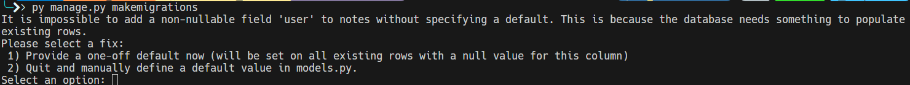
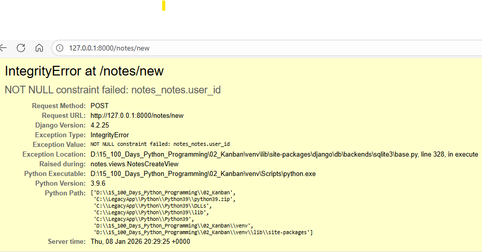
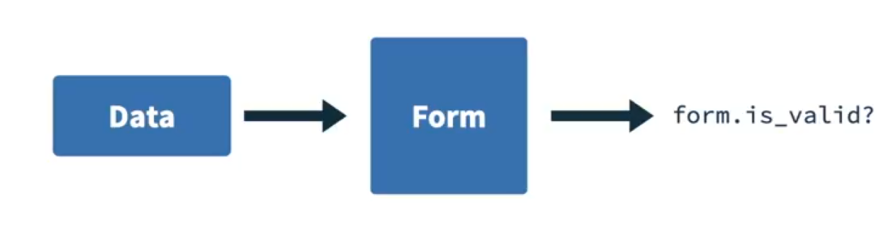
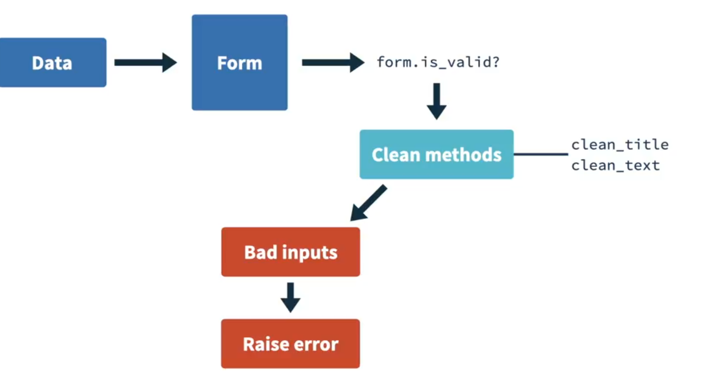
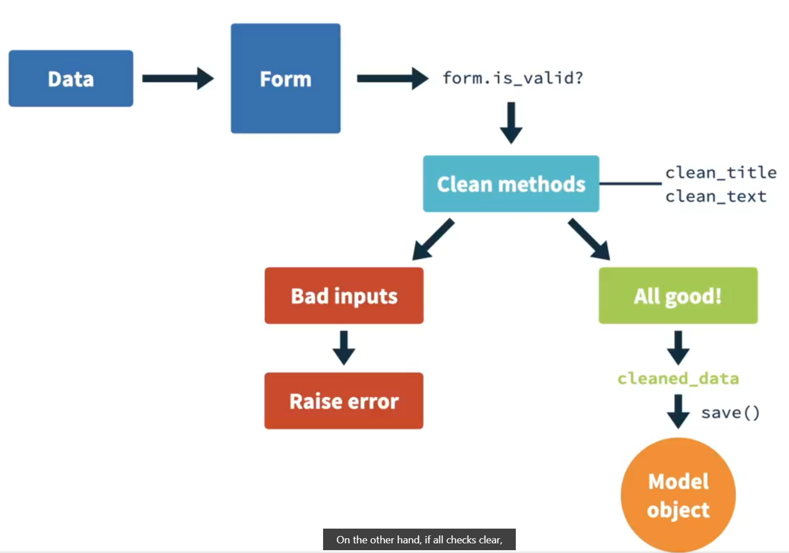
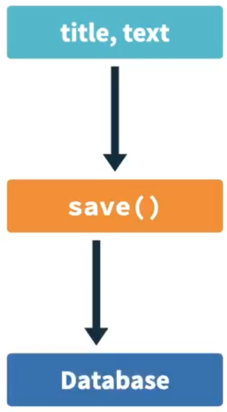
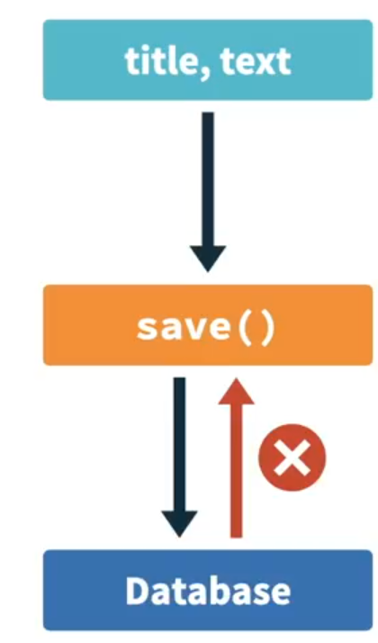
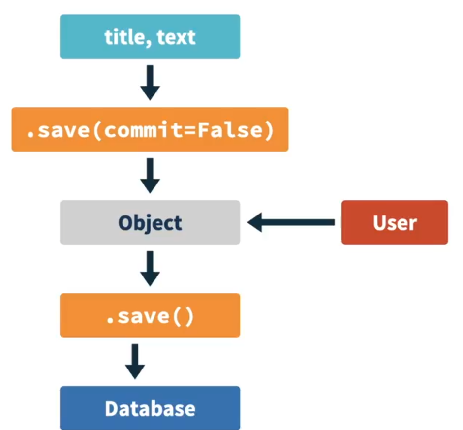
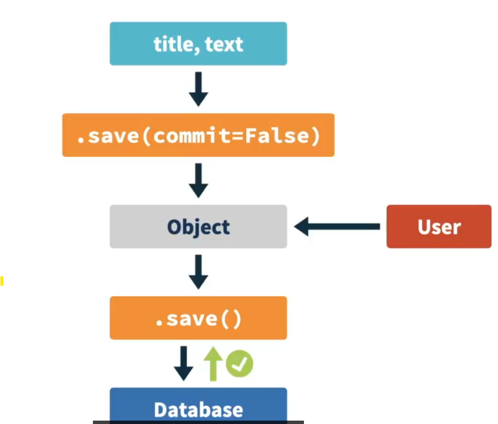

# -Store and Display Data with Django


-


## How to update data stored in your database
Right now, no matter if a user is logged into an account, they can create notes on the system. However, we want the system to be aware of who's logged in and only display the notes written by their original author. 

How can we do that? So far, we have two tables in our database, the Notes table and the User table. We need to save in the Notes which user was the author, and we can do that by creating a link between the User table and the Notes table. This is what we call a foreign key. 

Let's go back to our model and import the user model that comes with Django by default.
```py
 from django.contrib.auth.models import User

```
Now we go to the Notes model and we add a foreign key. Now we go here and we add models.foreignKey. 
```py
 from django.contrib.auth.models import User
 
 class Notes(models.Model):
    title = models.CharField(max_length=200)
    text = models.TextField()
    created = models.DateField(auto_now_add=True)
    user = models.ForeignKey()

```

This here needs a couple of things. The first item is the model we want to create a link with. In this case, this is the user model we just imported.
```py
 from django.contrib.auth.models import User
 
 class Notes(models.Model):
    title = models.CharField(max_length=200)
    text = models.TextField()
    created = models.DateField(auto_now_add=True)
    user = models.ForeignKey(User,)

```
Then, the second item is going to be the on_delete. This means that we want to define what happens to this node if the user associated with it is deleted. In this case, we're going to use models.CASCADE, which means that if a user gets deleted, we also want to delete all the notes associated with them. 
```py
 from django.contrib.auth.models import User
 
 class Notes(models.Model):
    title = models.CharField(max_length=200)
    text = models.TextField()
    created = models.DateField(auto_now_add=True)
    user = models.ForeignKey(User,on_delete=models.CASCADE)

```
Finally, we can say how we will identify this relationship on the user side.
```py
 from django.contrib.auth.models import User
 
 class Notes(models.Model):
    title = models.CharField(max_length=200)
    text = models.TextField()
    created = models.DateField(auto_now_add=True)
    user = models.ForeignKey(User,on_delete=models.CASCADE, related_name="notes")
```

Okay, now that we change the model, we need to create a migration. 
```bash
$ py manage.py makemigtations
$ py manage.py migrate
```
And we're getting an error. 

The problem here is that we defined that every node needs to be associated with a user, but our database is already fully populated by notes without users. So we need to define what to do now. Since we have a user, admin, and its ID is one, we can pass this as the default user on this migration. If we pass any ID of a user that doesn't exist, this migration will fail. So we should pass an ID of a user that exists. Let's add one. 

We're going to provide a one-off default, and the ID is going to be one. Okay, so now we can actually apply the changes to the database with python manage.py migrate. As I said, this is only working because we do have a user with ID equals one in our database, but it would break otherwise. When creating migrations and adding default values, you should always take care to avoid creating migrations that can break if you start a project again from scratch. Let's test our implementation and see if it works by opening the shell. 
```bash
py manage.py shell
```
And let's import the user. 
```bash
From django.contrib.auth.models import User
```
Let's get the first user. So user is going to be:
```bash
user = User.objects.get(pk=1)
```
So this is the admin user that we've been using so far. What we can do now is actually see the notes that this user have so we can count them, and we can see that all the five notes that we have in our system is associated to that user.
```bash
user.notes.count()
```
 We can even get all the notes from here. So if write:
```bash
user.notes.all()
```
We're going to have all the object notes we being displayed here. That's it. Now we can start making changes to make the system user-aware.

## Template for update
Every node now has the user that created it, but our endpoint is still displaying all the notes from all the users. We also didn't add any authentication. So in order to keep privacy, we need to fix that. So let's go back here on the  `notes/views.py`, and import:
```py
from django.contrib.auth.mixins import LoginRequiredMixin
```

Then on the list view, we need to add the login require mixin, and let's not forget to add the login URL. So for now, this is going to be the admin. This login URL means that if a user tried to access the list view, and it's not logged in, they will be redirected to the slash admin instead of seeing a 404.
```py
class NoteListView(LoginRequiredMixin, ListView):
    model = Notes
    context_object_name = 'notelist'
    template_name = "notes/notes_list.html"
    login_url="/admin"
```

Okay, so now what we need is to change the query so we can only display the queries of the logged in user. But where is the query? (chuckling) As we discussed earlier, class-based views are highly powerful, and yet highly changeable. We can use a documentation website to check for all the methods that we have available, and find out which ones we need to change to get the behavior we want. 

This is the [website](https://ccbv.co.uk/projects/Django/5.2/django.views.generic.list/ListView/) that I look for when I want to change a class-based view. It calls CCBV because it's called classy class-based views. You can see here that we can change the Django version we're using. So let's go to the generic list, and go to list view. In here, you can see all the classes, the methods, the attributes, everything we can configure in this list view, class-based view. So after some investigation, I realize there is a get query set method here. Whenever a user go to the list endpoint, the first method that it will call will be the get method, because we're making an ATTP get request. Let's check it out. 


We can quickly see that there is a method here that gets the object list by calling a method called get query set. So let's check that method. Get query set, here it is. There's still a lot of things going on here, but we can see that this is the method where the query to the database is made. This is the method that we need to alter in order to list only our user notes. If we go back to the code now, we can actually override the get query set method, and instead of returning whatever it is returning by default, we're going to return `self.request.not.all`. That's it. A couple of changes in our endpoint is requiring user authentication, and then using the user of that request to just display the notes that were created by that user:
```py
class NoteListView(LoginRequiredMixin, ListView):
    model = Notes
    context_object_name = 'notelist'
    template_name = "notes/notes_list.html"
    login_url="/admin"

    def get_queryset(self):
        return self.request.user.notes.all()
```

## Endpoint and template for deleting
We changed our notes to have a user, but let's try to add a new one and see what happens. So this is a new note. Does it work? Let's submit. Uh-oh, okay. We have an error. 


You can see here that there is a constraint that a note can't have a null user. The problem is that we don't say in the form to consider the logged-in user as the author of that note. So we need to change this, and this is a bit tricky, so bear with me for a second. So in here, on the CreateView, we're going to override the method `form_valid` that receives a self and form. The first thing it is that we need to get the object (`self.object`), which is going to be `form.save`, and then `commit = False`. Now we're going to fill the object `self.object.user` is going to receive the request.user (`self.request.user`) and then we're going to `self.object.save()`. And finally, we need to return an `HttpResponseRedirect`.  And then this is going to get self.get_success_url. Let's see, the HttpResponseRedirect is already being imported from django.http.response. And that's it. That's what we need to get our form validating.
```py
from django.http.response import HttpresponseRedirect

class NotesCreateView(CreateView):
    model = Notes
    success_url = 'notelist'
    form_class = NotesForm

    def form_valid(self, form):
        self.object = form.save(commit=False)
        self.object.user = self.request.user
        self.object.save()

        return HttpResponseRedirect(self.get_success_url())
```

Okay, so that was a little bit tricky. Let's understand what's going on here. So the data is sent by the user, passed inside the form, which asks a simple question. Is this data valid? 
 

To see if the data is valid, the form would call a couple of methods that have the title starting with clean, so clean title, clean text, like the one we changed before. If something is wrong, the method isValid returns false, and the class-based view will raise an exception. 


On the other hand, if all checks clear, the data is stored in a variable called cleaned_data. And when you call form.save, that will save the object directly in the database and that's it. 


So what happens here is that when we pass title and text to the form, the method isValid returns True. Then the formValid method will call the save and will try to save to the database. 


But although the form is returning isValid = True, the database is forbidding us to try to save a note without a user. That's where we get our error. 


What we did here was to get in the middle of it so we can inject the logged user as part of the object. We do this by passing the attribute commit = False that creates the object but doesn't save it to the database. 


Then we have the object, we insert the user and then we call save, successfully saving the note with that user to the database. 


As you can see, class-based views can be changed as you please. 


So we refresh here and add a new node. Yeah, as you can see, class-based views can be changed as you please. Now the endpoint is working and life is good again.
