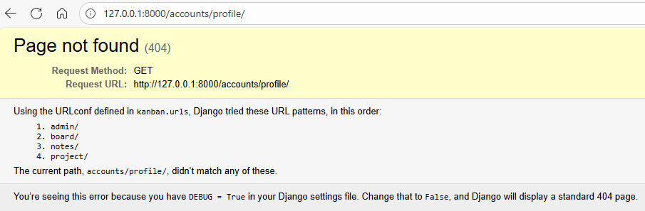

# Store and Display Data with Django

## Adding Login and Loagout Pages
We are almost there. The last thing remaining for our app is to create a proper login place. Although the admin login is nice, it can only be accessed by staff members of the system. So we need to create the authentication interface as well. Let's do this. So first let's go to `board/views.py` and then let's import here `from django.contrib.auth.views`, import `LoginView`. 
```py
from django.contrib.auth.views import LoginView
```

And then let's create a class called logininterfaceview that inherits from login view. 
```py
from django.contrib.auth.views import loginview

class LoginInterfaceView(LoginView):
```

And in here, we only need to define really one thing, the template name. So let's go call it `board/login.html`. 
```py
from django.contrib.auth.views import loginview

class LoginInterfaceView(LoginView):
    template_name = 'board/login.html'
```

Okay, so we can forget about the URLs. Open the `board/urls.py`. So in here, let's add a login page that inherits from views, login interface view as view. 
```py
urlpatterns = [
    path('home', views.HomeView.as_view()),
    path('todolist', views.AuthorizedView.as_view()),
    path('login', views.LoginInterfaceView.as_view()),
]
```

Okay, so now we can create a template so add the new login.html. And in here, really all we need to do is extends base.html to get all our configuration, to then block content, and finally, endblock. 
```html



```

Okay, so in here, what we need is simply a form. This form should have method equals to post. Because this is a form with the method posts, we can't forget what our dear friend csrf_token. And then we're going to use `{{ form.as_p }}` because it's going to be rendered as P tags in the HTML. That's the only difference. And finally, we're going to have an input. The type's going to be submit. Let's add some class here. So BTN and BTN secondary.
```html


    <form method='post'> 
        {{ form.as_p }}
        <input type='submit' class="btn btn-seconday">
    </form>

```

So we're going to go here, go to login. Okay, let's try to log in. Okay, so what's happened here? 


The problem is that Django has a default system, defined configuration for the redirect, which leads to a page we don't have, which is this account profile page. Because this is a global definition, we should change this not in the class-based views, but we should change it on the settings.Let's go back to `kanban/settings`, and at the bottom part of the file add:
```py
LOGIN_REDIRECT_URL = 'notes/noteslist'
```
 
Login redirect url, is going to be `notes/noteslist`. So this is where we're going to redirect the user after it is logged in. So let's try this again. I just remember we are completely logged in here. So first, let's log out to make sure our login work. So log in, then let's add our credentials and it works. Amazing. 

Okay, so similarly, we also want a logout view, right? We don't want to have to go to the admin to do this. So let's add this real quick. So on the `board/views`, and import logout view. 
```py
from django.contrib.auth.views import LoginView, LogoutView
```

And similarly, we're going to create a logout interface view that inherits from logout view. And the only thing we need is the template name. Yes. So let's add here, home/logout.html. Okay, so let's create the template. Logout.html. 
```py
from django.contrib.auth.views import LoginView, LogoutView

class LogoutInterfaceView(LogoutView):
    template_name = 'board/logout.html'
```

Instead of having a form, we're going to have an h1 that says, hope to see you soon. 
```html
 
<h1>Hope to see you soon</h1>


```

Okay. Oh yes, and we're missing the URLs. So let's do this. We are copying logout and logout. 
```py
urlpatterns = [
    path('home', views.HomeView.as_view()),
    path('authorized', views.AuthorizedView.as_view()),
    path('login', views.LoginInterfaceView.as_view()),
    path('logout', views.LogoutInterfaceView.as_view()),
]
```

And for the sake of organization, let's add names to this URLs, shall we? So this is going to be our homepage. We can actually get rid of this. Our system doesn't really need this. Then we have login and finally logout.
```py
urlpatterns = [
    path('', views.HomeView.as_view(), name='home'),
    path('login', views.LoginInterfaceView.as_view(), name='login'),
    path('logout', views.LogoutInterfaceView.as_view(), nane='logout'),
]
```
Okay, one more tidy up to do. Let's make this empty. Okay, let's see what that causes. If we go back, the empty here means that now this welcome page is going to be the default page without any path. And then if you go to logout and try to access the smart notes again, there you go, because we're logged out, now we can't access the notes and it redirects to the Django login. We need to change that as well, but I'm going to leave this to you.

## Adding a singup Page
Open the `board/views.py` and update the file with:
```py
from django.views.generic.edit import CreateView
from django.shortcuts import redirect
```

Then create a class call `SignupView`:
```py
from django.views.generic.edit import CreateView
from django.shortcuts import redirect
from django.contrib.auth.forms import UserCreationForm

class SignupView(CreateView):
    form_class = UserCreationForm
    template_name = 'home/register.html'
    success_url = '/smart/notes'

    def get(self, request, *args, **kwargs):
        if self.request.user.is_authenticated:
            return redirect('notes.list')
        return super().get(request, *args, **kwargs)
```

Add `board/url.py` the new path sigup:
```py
urlpatterns = [ 
    path('', views.HomeView.as_view(), name='home'),
    path('login', views.LoginInterfaceView.as_view(), name='login'),
    path('logout', views.LogoutInterfaceView.as_view(), name='logout'),
    path('signup', views.SignupView.as_view(), name='signup'),
]
```

Finally we need to create a teamplate call `register.html` and edit as follow
```html



<form method='POST' style='text-align: left; margin: 0 auto; width: 600px;'>
    {{form.as_p}}
    <input class='btn btn-secondary' type='submit' name='Submit'/>
</form>


```

## Fixing the Login and Logout for Django 4 & 5
Okay, we are so close. It's time to add it all together. So let's go to the `base.html` template and add a couple of things. So we're going to add a nav bar. Let's indent this correctly. And then in here, we're going to pass a couple of classes. So we're going to use navbar navbar-dark and bg-dark. Okay. We're also going to need another div here. And this div, we have a class ms-auto. And let's create a link here for the Login page. So we're going to pass a URL, and this URL was going to be the login. Let's close this, and let's add some style here as well. So the glasses we're going to use is going to be the btn btn-outline-light, because we're going to have a black navbar, and me-1. Okay, perfect. Let's see what happens here.
```html
    <nav class="navbar navbar-dark bg-dark">
        <div class="ms-auto">
            <a href="" class="btn btn-outline-light me-1">Login</a>
        </div>
    </nav>

```

 Now we have a top bar, black, and we have a button for the login. Perfect. However, if the user is authenticated, it doesn't make sense to have a login button here, right? So let's add some logic to change that. Let's go back to the code. So what we can do here is add an if statement to see if the user is authenticated. If the user is authenticated, what we're going to do is add a logout logic. However, if the user is not authenticated, this means else, then we're going to show the Login button. 
 ```html
    <nav class="navbar navbar-dark bg-dark">
        
        <!-- Logout Logic -->

        
        <div class="ms-auto">
            <a href="" class="btn btn-outline-light me-1">Login</a>
        </div>
        
    </nav>

```
 
 Finally, we can end our if. Okay, so the way we add a logout logic here will depend on the version of Django that you are running. On versions 4.x or below, it's very simple. We just need a link here.  So we can copy these, Django 4.0, and we can have the logout URL and a Logout. And that's it. 
  ```html
    <nav class="navbar navbar-dark bg-dark">
        
        <!-- Logout Logic -->
        <div class="ms-auto">
            <a href="" class="btn btn-outline-light me-1">Logout</a>
        </div>
        
        <div class="ms-auto">
            <a href="" class="btn btn-outline-light me-1">Login</a>
        </div>
        
    </nav>
```

 However, if you are running a version that is later or the same as 5.0, this link won't work. This is because now, logout must be a POST request instead of a GET. Thankfully, we know how to make a POST request. We need a form. What we can do here is to wrap our button into a form to actually make a POST request. So let's do that. So let's remove this, and I am going to change here. So if you're using 5.0+, you have to do this. Let's create a new form, okay? The method must be post. We need an action URL. So in this case here, we're going to pass the logout URL. So it's the same URL, but now we're going to do a POST method and some class with some style. So d-inline here. Perfect. 
   ```html
    <nav class="navbar navbar-dark bg-dark">
        
        <!-- Logout Logic -->
        <form method='post' action="" class="d-inline">
            
            <button type="submit" class="btn btn-outline-light me-1">Logout</button>
        </form>
        
        <div class="ms-auto">
            <a href="" class="btn btn-outline-light me-1">Login</a>
        </div>
        
    </nav>

```
 
 
 Remember, because this is a form, we're making a POST request, we need our security token. So let's add the csrf-token here. And now we need a button called Logout. And this button must have the type submit. And then we can pass the same style as the login here. Okay, let's go back and check what happened. Because I am authenticated, instead of showing the Login, it is actually showing me the Logout page. Awesome. Since we're already here and we have a navigation bar, let's also add a button to the homepage. So we can actually copy this here, and we can add this, if the user is authenticated, a Home button, and then we're going to pass the URL to be home. 
     <nav class="navbar navbar-dark bg-dark">
        
        <!-- Logout Logic -->
        <div class="ms-auto">
            <a href="" class="btn btn-outline-light me-1">Home</a>
            <a href="" class="btn btn-outline-light me-1">Create</a>
            <a href="" class="btn btn-outline-light me-1">Logout</a>
        </div>
        
        <div class="ms-auto">
            <a href="" class="btn btn-outline-light me-1">Login</a>
        </div>
        
    </nav>
 
 Let's go back, let's refresh. And there you go. Done and done. Now we have our whole app and a navigation bar fully working.

## Finishing Touches