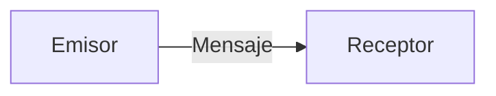

# La Comunicacion Moderna. 

## Modelo de Comunicacion Basico (Tradicional). 

La forma, el medio o el contexto son clave en nuestra comunicacion sin embargo como primer definicion de lo que es couminicacion diremos que esta se encuentra constituida de tres elementos: 

**¿Podemos mejoar como emiros?** o **¿Podemos mejorar como receptores?**. Diremos que si <b style="color:red">¿Porque? Las Justificacion general es que basicamente estamos llegando a un curso con un metodo o una forma de comunicarnos, y no necesariamente es la mejor, si queremos mejorar nuestra capacidad de comunicarnos para lograr un objetivo en comun, aprender un tema o generar un vinculo afectivo</b>

### Los mejores Emisores
Los mejores emisores son aquellos que distinguen el tipo de comunicacion que emplearan segun lo que quieren transmitir y lograr; es decir: **se comunican estrategicamente**, no improvisadamente (continuar con los sesgos). Los buenos emisores estan consicientes de los elementos (distingir hechos, opiones (creo, humildad), sentimientos, consecuencias, acuerdos, justificaciones) y la estructura misma del lenguaje (estar mas conciente de la manera en que ordeno las ideas) por ejemplo: 

* **Finalidad:** Diseñar un mensaje que tome en cuenta su proposito, que surja de una intencion clara de:
  * Generar vinculos afectivos.
  * Lograr un resultao
  * Aprende algo
  
* **Lugar y tiempo:** Al diseñar un mensaje y definir su proposito debemos de preguntarnos cual es el mejor contexto y momento para presentarlo.
  
* **Monotematico:** Tener una conversacion y cerrarla (hablar de una cosa a la vez) 
  
* **Adaptacion a los interlocutores:** Adaptar el mensaje para generar una misma pespectiva entendiendo la naturaleza de la comunicacion (cual es la naturaleza de emisor y cual es la naturaleza del receptor)

### Los mejores Receptores. 
Los mejores escuchas son aquellos que escuchan y conectan con el: 

* Ritmo
* Estado
* Contenido 